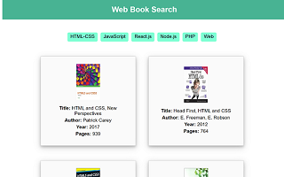

# Book Search

- Features
- Built with
- Links
- Author

## Features

- A simple search filter project to display a filtered books. 
- This is based on the search by books category choice from the user. 
- By selecting a category, all books from that one are displayed.

## Screenshot
 

## Built with

- HTML5 markup 
- CSS properties
- Reactjs (components, hook)

## Links

- Solution URL: https://github.com/Antho137/book-search
- Live Site URL: https://antho137.github.io/book-search/

## Author

- Antonio N. Sala - Frontend Web Developer